# Rock Paper Scissors by Nafi

This is a project created to solve coding challenges at Binar Academy. This project was created using Express JS, Postgresql, Bootstrap, and plain HTML, CSS, Javascript.

There is a page for playing rock-paper-scissors game for users and there is a dashboard page for admin.

## Usage

You can access the website at *[here](https://rock-paper-scissors-nafi.herokuapp.com/)*. 

And this is what you can do.

### 1. Click Sign Up to register your account.
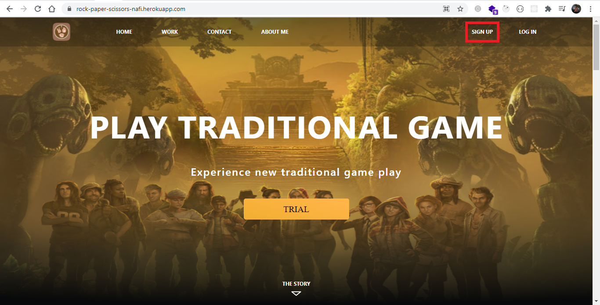

### 2. Register your account as user player.
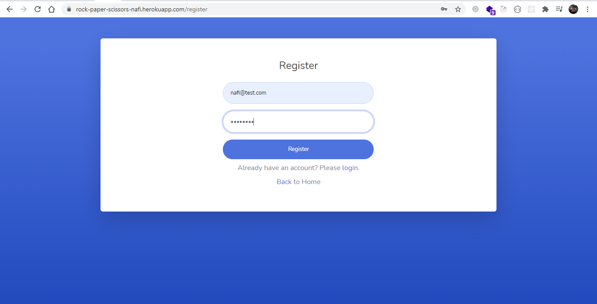

### 3. Login with your account
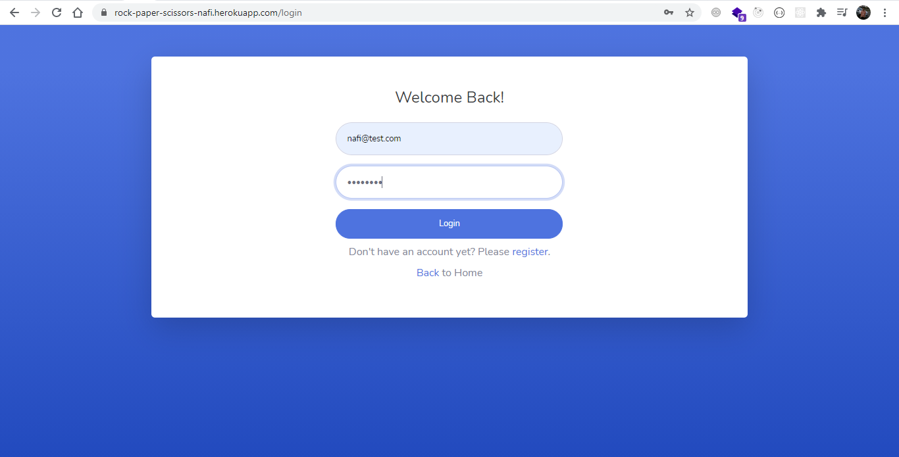

### 4. Click Trial to play rock-paper-scissors
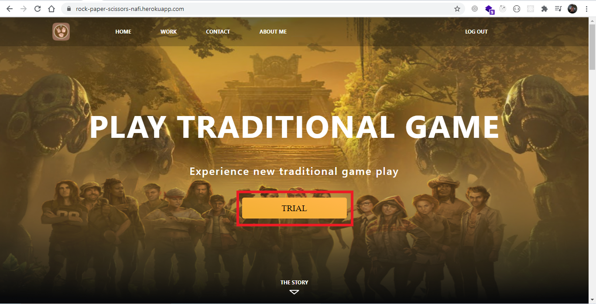

### 5. Make your choice
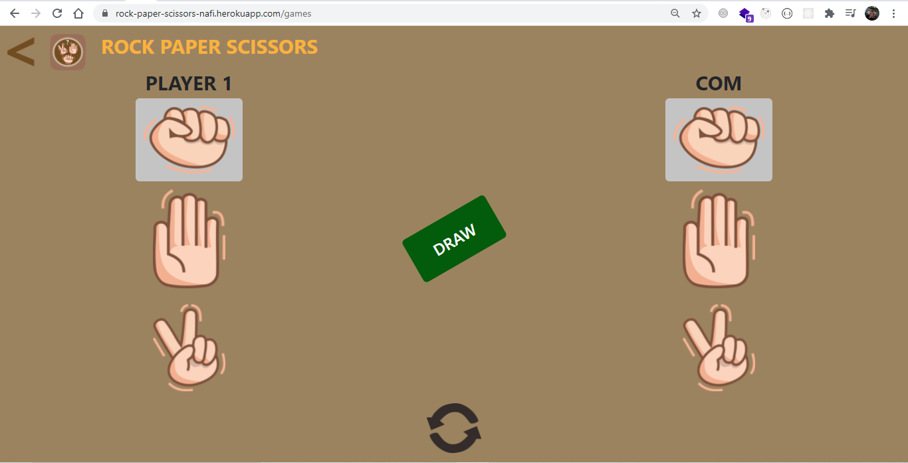

### 6. Click refresh icon to play again
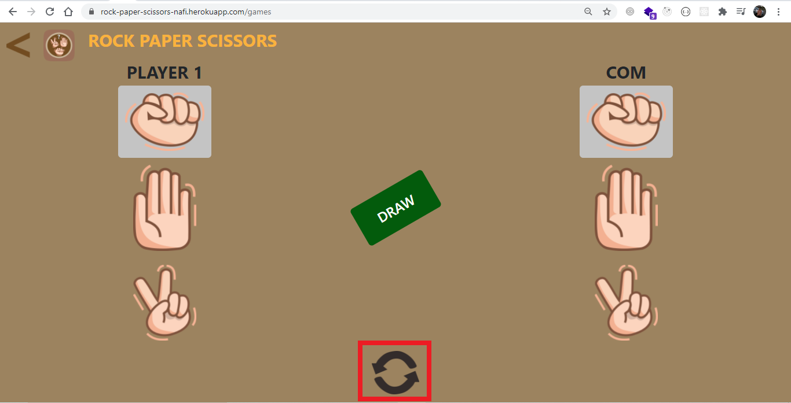

### 7. Click this button if you want to back to landing page
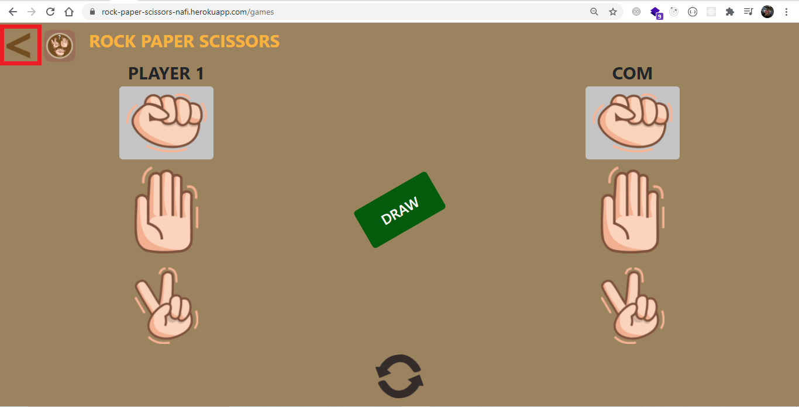

### 8. Logout your account
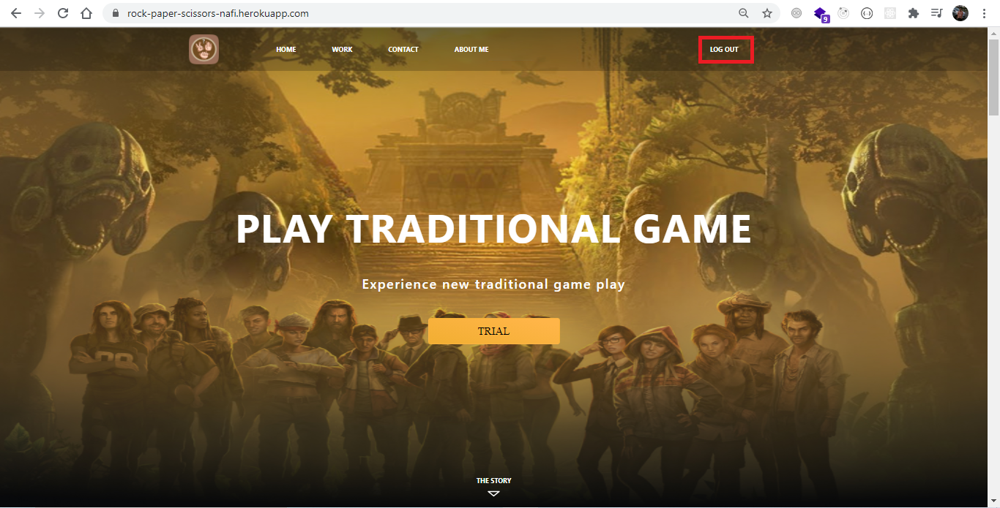

### 9. Change the url to be like this to go to the admin dashboard. [https://rock-paper-scissors-nafi.herokuapp.com/admin](https://rock-paper-scissors-nafi.herokuapp.com/admin)
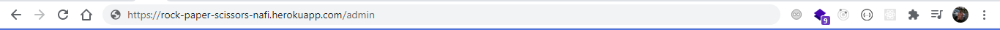

### 10. Login as admin user. Just simply click the login button. I have provided the email and password as the default value if you want to try it.
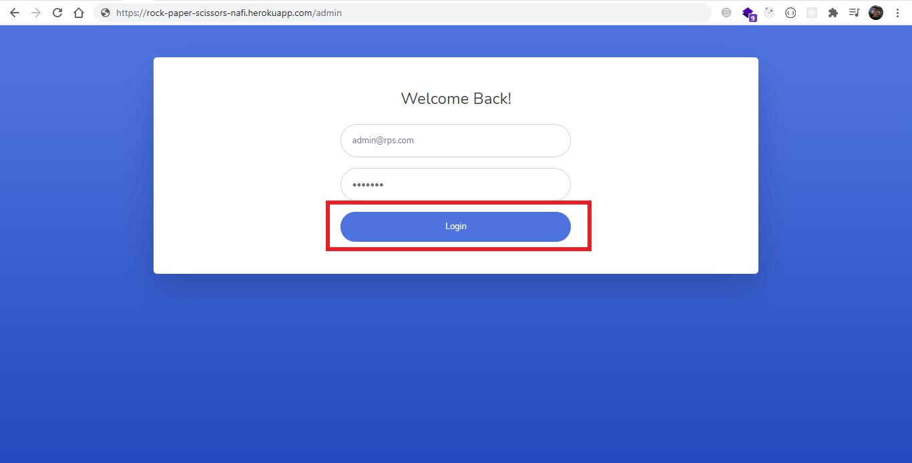

### 11. And you can act like the admin.
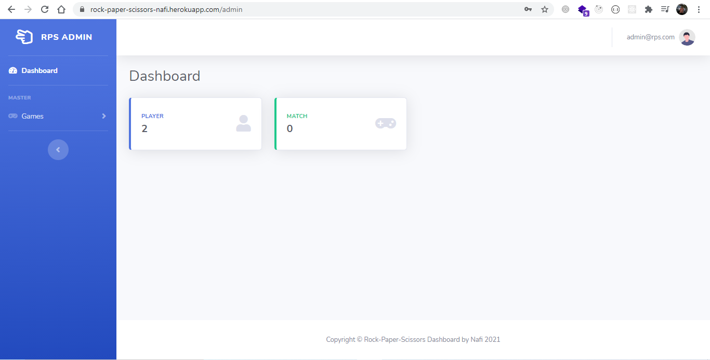

## Contributing
Pull requests are welcome. For major changes, please open an issue first to discuss what you would like to change.

Please make sure to update tests as appropriate.
